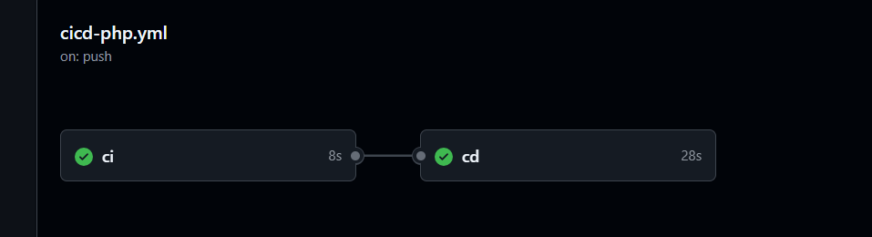

##  Configuración del Flujo CI/CD con GitHub Actions y Docker Hub

Este repositorio incluye un flujo automatizado de **Integración Continua (CI)** y **Despliegue Continuo (CD)** configurado mediante GitHub Actions. El objetivo principal es validar el código PHP con pruebas unitarias y, si todo es correcto, compilar una imagen de Docker y subirla automáticamente a una cuenta personal de Docker Hub.

###  Archivos del Flujo de Trabajo

El flujo de trabajo se gestiona desde la carpeta `.github/workflows/`, donde se trabajó específicamente con tres archivos de configuración:

1. **`ci-php.yml`**: Se encarga únicamente de la etapa de pruebas y validación del entorno de PHP.
2. **`cicd-php_II.yml`**: Archivo de desarrollo intermedio utilizado para estructurar las fases combinadas de CI y CD.
3. **`cicd-php.yml`**: El archivo principal y definitivo que ejecuta con éxito todo el pipeline automatizado tras cada `push`.

###  Requisitos Previos y Configuración de Secretos

Para que el proceso de despliegue continuo (`cd`) funcione correctamente en tu propia cuenta de GitHub, es **obligatorio** enlazar tus credenciales de Docker Hub. De lo contrario, el servidor virtual de GitHub no tendrá permisos para subir la imagen.

Esto se logra siguiendo los siguientes pasos para configurar tus credenciales de forma segura:

1. repositorio en GitHub > **Settings** 
2. En el menú lateral izquierdo > **Secrets and variables** y selecciona **Actions**.
3. En la sección **Repository secrets**, clic en **New repository secret** para añadir las siguientes dos variables con sus nombres exactos en mayúsculas:
   * **`DOCKER_USER`**: nombre de usuario de Docker Hub.
   * **`DOCKER_PASSWORD`**: contraseña o un Access Token generado en Docker Hub.

### 🛠️ Estructura del Pipeline (`cicd-php.yml`)

El archivo definitivo ejecuta dos etapas consecutivas de manera automática:

#### 1. Etapa de Integración Continua (`ci`)
Corre sobre un entorno aislado de `ubuntu-latest` y realiza las siguientes tareas:
* Descarga el código del repositorio (`actions/checkout`).
* Valida la estructura de los archivos `composer.json` y `composer.lock`.
* Instala las dependencias del proyecto de forma limpia.
* Ejecuta la suite de pruebas unitarias mediante `composer run-script testdox` (utilizando **PHPUnit**).

#### 2. Etapa de Despliegue Continuo (`cd`)
Esta etapa requiere que la fase `ci` haya finalizado con éxito (`needs: ci`). Realiza lo siguiente:
* Inicia sesión en Docker Hub de forma segura utilizando las variables ocultas `${{ secrets.DOCKER_USER }}` y `${{ secrets.DOCKER_PASSWORD }}`.
* Construye la imagen de Docker basada en el `Dockerfile` del proyecto.
* Sube (*push*) la imagen final con la etiqueta `:latest` al repositorio público del usuario en Docker Hub.

###  Verificación del Funcionamiento

Una vez que realizas un cambio en tu código local y subirlo, inmediatamente iremos a nuestro repositorio e iremos al apartado de actions y ahi podremos ver push que realizamos, dentro de eso podremos ver a  ci y cd ejecutandose y marcando en verde si realizamos todo bien 

### Verificacion en Docker Hub

Una ves ci y cd este funcionando, podremos ver en docker hub en nuestros respositorios lo que hicimos:

